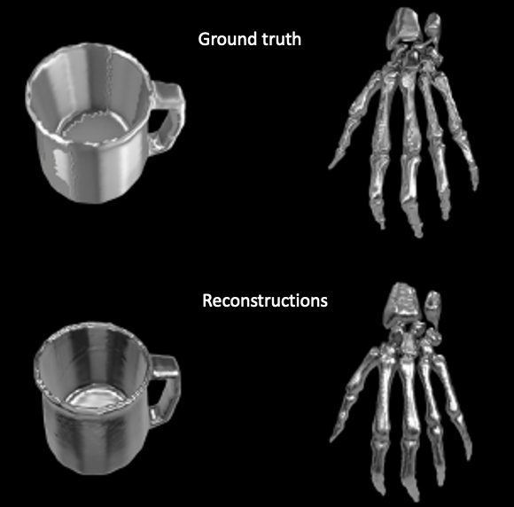

# Enhanced GPIS Learning Based on Local and Global Focus Areas (eGPIS)



This is the code for [Enhanced GPIS Learning Based on Local and Global Focus Areas, IEEE Robotics and Automation Letters, 2022]

Dataset link: https://drive.google.com/u/0/uc?id=1CExHFuHvECp06Wc1xp02MRTHTacwUhlw

To download datasets and initialise folders run 
```
bash download_datastes.sh
bash init.sh
```

To run experiments: run
```python
cd src
python3 main.py
```

If you find this code useful in your research, please consider citing:

```
@ARTICLE{9854140,
  author={Murvanidze, Zuka and Deisenroth, Marc Peter and Bekiroglu, Yasemin},
  journal={IEEE Robotics and Automation Letters}, 
  title={Enhanced GPIS Learning Based on Local and Global Focus Areas}, 
  year={2022},
  volume={7},
  number={4},
  pages={11759-11766},
  doi={10.1109/LRA.2022.3197905}}
```
